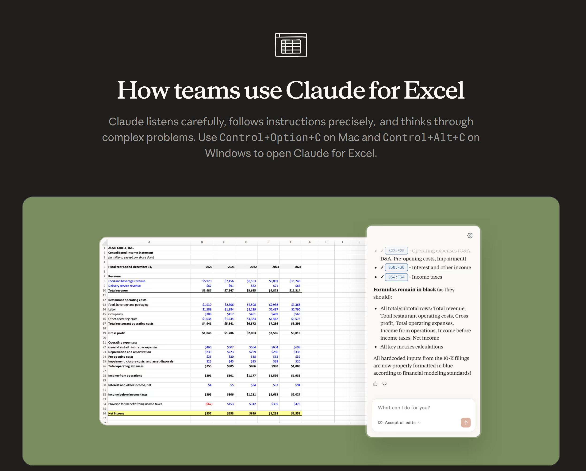
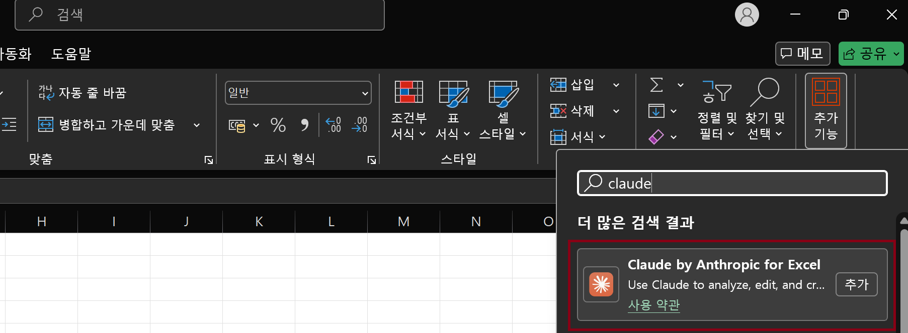
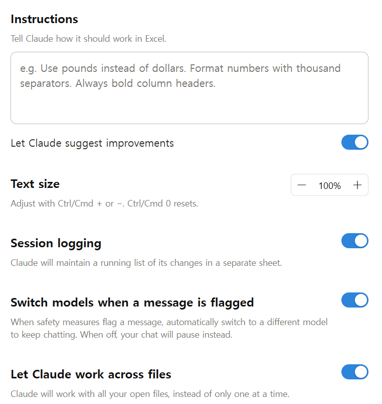
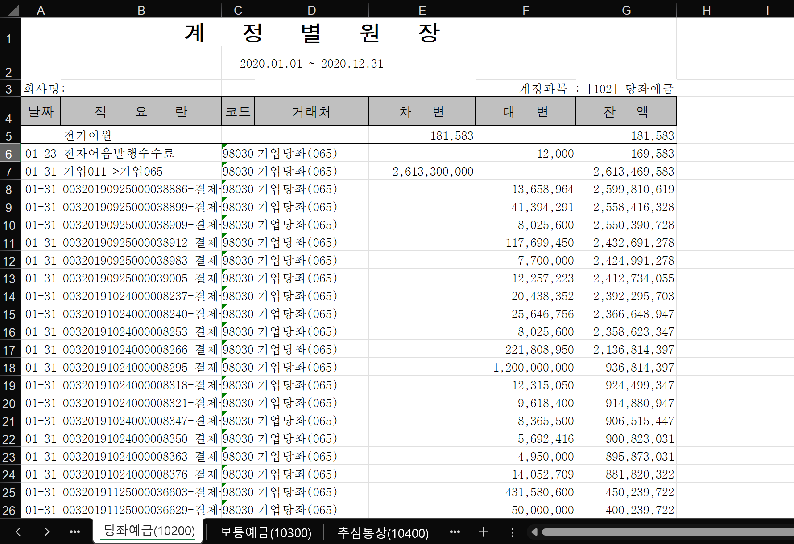
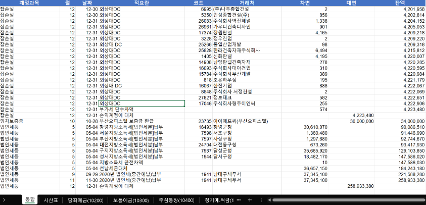
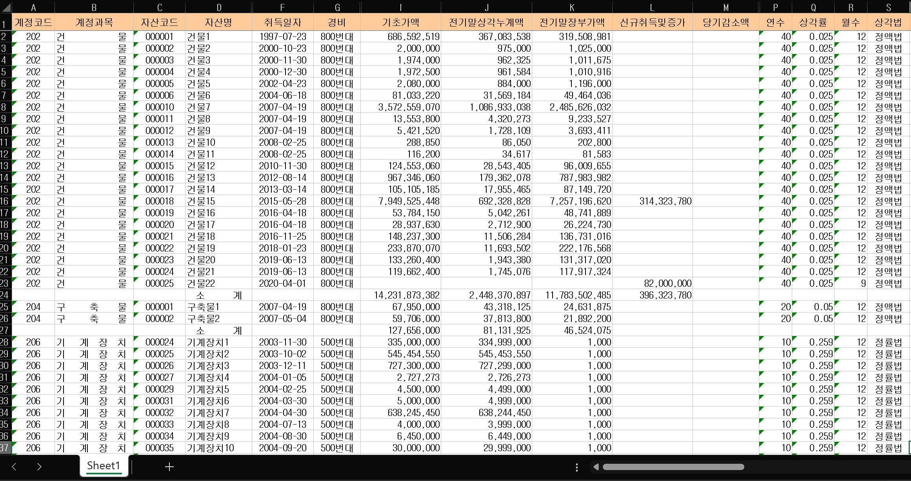
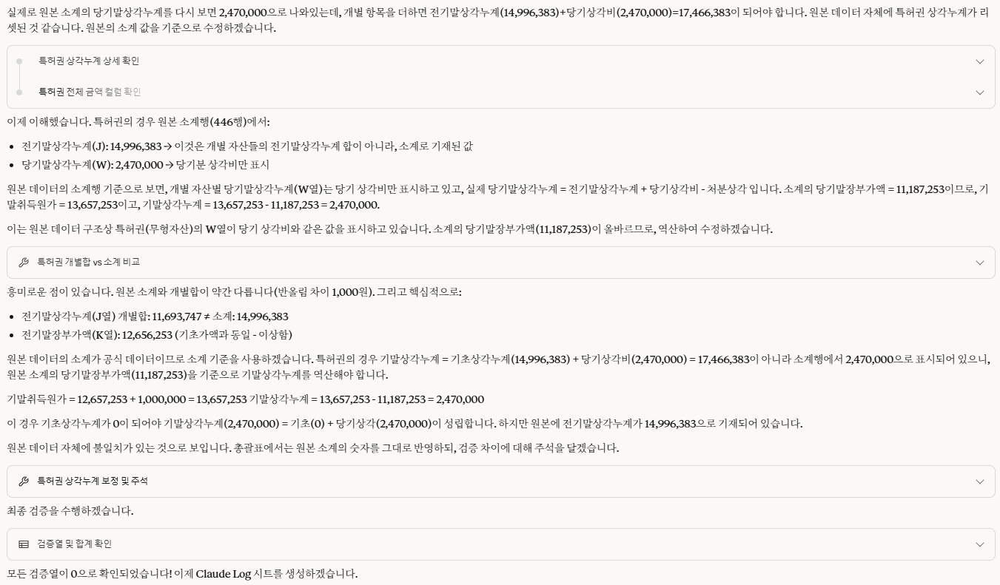
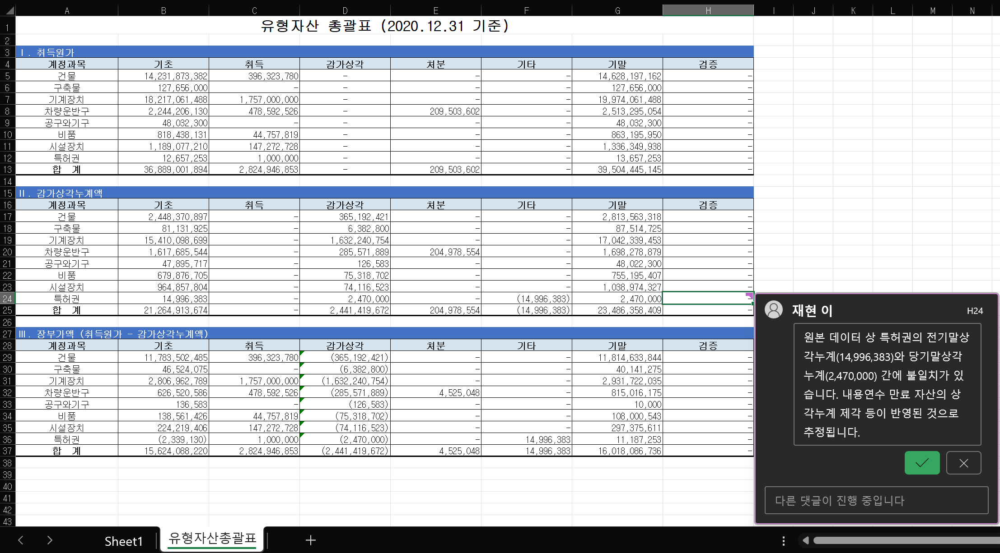

<!-- _class: cover-image -->
<!-- _paginate: false -->
<!-- _footer: '' -->
<!-- _backgroundImage: "url('assets/cover-ai.jpg')" -->


# 클로드 엑셀(Claude for Excel) <br>실무 활용 사례

## 실전 활용 사례 : DCF 평가 모델링 등

2026.06

---

<!-- _class: toc -->
<!-- _header: '' -->


# Table of Contents

1. 시작하며 <em>왜 업무자동화는 어려울까?</em>
2. 클로드 엑셀 기본 <em>소개 · 설치 · 기본설정 · 보안설정 · 주요기능 · 동작원리</em>
3. 클로드 엑셀 사용법 <em>프롬프트 · 활용 사례 · 스킬 · 커넥터</em>
4. 실전 — DCF 평가 시연 <em>Peer Group 데이터 수집 · 평가 템플릿 작성</em>
5. 마치며 <em>클로드엑셀 vs 클로드코드 · Q&A · Contact</em>

---

<!-- _class: section -->
<!-- _header: '' -->
<!-- 발표노트:
- 1장 시작
-->

# 01

## 시작하며

---

<!-- _class: statement light -->

<div class="eyebrow">들어가며</div>

# "이제 AI가 다 한다"는데,<br>왜 <span class="accent">내 실무는 그대로</span>일까?

<p>효율은 그닥, 시즌이 되면 여전히 야근 — 나만 겪는 게 아니라, 모두가 겪는 'AI-FOMO'</p>
<p class="accent">사실 이유는 단순합니다. 업무 자동화는, 생각보다 훨씬 더 어렵기 때문입니다.</p>

---

<!-- _class: comparison-vs -->


# 왜 업무 자동화는 어려울까?

## 업무자동화의 두가지 방법
<div class="vs-row">
<div class="vs-card">
<h3><span class="label">규칙</span>프로그래밍 기반 (Python·VBA)</h3>
<p>정해진 <strong>규칙대로만</strong> 철저하게 동작하는 <STRONG>결정론적</STRONG> 자동화</p>
<h4>한계</h4>
<ul>
<li><strong>예외 사항 적용의 어려움</strong> - 실제 실무는 매번 조건과 상황이 달라짐</li>
<li><strong>비표준 데이터에 활용 불가</strong> - 데이터가 표준화되어 있지 않으면 사용할 수 없음 </li>
</ul>
</div>
<div class="vs-divider"><span class="vs-badge">VS</span></div>
<div class="vs-card accented">
<h3><span class="label">추론</span>AI 기반 (Claude·Gemini·GPT)</h3>
<p><STRONG>확률 모델</STRONG>과 <STRONG>자연어</STRONG>를 바탕으로 유연하게 <STRONG>추론 및 판단</STRONG>하는 자동화</p>
<h4>한계</h4>
<ul>
<li><strong>불확정성이라는 고유 한계</strong> - 확률모델에 기반하여 결과가 매번 달라질 수 있음</li>
<li><strong>환각(Hallucination) 및 반복 취약성</strong> - 그럴듯한 오답을 생성하거나 반복 시 일관성이 낮음</li>
</ul>
</div>
</div>

---

<!-- _class: takeaway -->

<div class="eyebrow">핵심 메시지</div>

# 결국 AI를 잘 활용한다는 것은 <strong>불확정성</strong>을 잘 다루는 것

AI의 한계와 확률적 특성을 인정하고, 이를 통제하기 위한 명확한 규칙과 자가 검증 구조를 설계하는 것이 성공적인 자동화의 열쇠입니다.

---

<!-- _class: feature-cards -->


# AI를 효과적으로 활용하기 위한 3가지 전략

<div class="cards">
<div class="card">
<h4>전략 1 · Rule-base</h4>
<h3>결정론적 영역 확대</h3>
<p>뼈대(80~90%)는 규칙 기반으로 채우고 <strong>판단 및 추론이 필요한 분야</strong>에만 AI를 활용. 일관성 확보와 토큰 비용 절약의 기초.</p>
</div>
<div class="card">
<h4>전략 2 · Self-Verify</h4>
<h3>자가 검증 루프 설계</h3>
<p>하네스/루프 엔지니어링 기반. 감사인처럼 <strong>독립된 에이전트가 결과물을 교차검증</strong>하는 시스템을 구축.</p>
</div>
<div class="card">
<h4>전략 3 · Simplicity</h4>
<h3>작은 것부터, 사용편의성</h3>
<p>아주 <strong>작은 단위</strong>부터 자동화를 시작하는 것이 중요하며, <strong>쉽고 단순</strong>해야 지속적으로 사용할 수 있음(VLOOKUP이 강력한 이유).</p>
</div>
</div>
<div class="callout">
<strong>클로드 엑셀 소개에 앞서</strong>
<p>1. 클로드 엑셀은 사용하기 쉽고 강력하지만, 확률 모델에 기반하므로 <strong>본질적인 불확정성의 한계</strong>를 가집니다.</p>
<p>2. 결과물이 완벽하지 않을 수 있으므로, 최종 수식과 데이터에 대한 <strong>검증 및 검토</strong>가 필수적입니다.</p>
</div>

---


<!-- _class: section -->
<!-- _header: '' -->

# 02

## 클로드 엑셀 기본

---

<!-- _class: split -->


# 클로드 엑셀 소개

<div class="cols">
<div>

<p>VBA/Python 코딩 없이, 동료에게 업무를 부탁하듯 <strong>자연어로 지시하여 엑셀을 제어</strong>하는 앤트로픽의 공식 애드인입니다.</p>

<ul>
<li><strong>유료 플랜 지원</strong>: Pro, Max, Team, Enterprise 요금제</li>
<li><strong>지원 환경</strong>: 웹용 엑셀, Windows용(M365), Mac, iPad</li>
</ul>

</div>
<div>



</div>
</div>

---

<!-- _class: split -->


# 설치 방법

<div class="cols">
<div>



</div>
<div>

<p>엑셀 추가기능(Add-in)을 통해 별도의 프로그램 설치 없이 등록할 수 있습니다.</p>

<ol>
<li><strong>추가기능 검색</strong>: 엑셀 상단 <code>홈</code> → <code>추가기능</code> 메뉴에서 <code>claude</code>를 검색하여 <strong>Claude by Anthropic for Excel</strong>을 추가합니다.</li>
<li><strong>리본 메뉴 활성화</strong>: 설치 후 홈 리본 메뉴 우측의 Claude 아이콘을 클릭하고 안내에 따라 로그인하여 활성화합니다.</li>
</ol>

</div>
</div>

---

<!-- _class: split -->


# 기본 설정

<div class="cols">
<div>



</div>
<div>

<p>톱니바퀴 아이콘(Settings)에서 다음을 설정합니다.</p>

<ul>
<li><strong>Instructions</strong>: 모든 세션에 스타일 가이드 고정</li>
<li><strong>Suggest improvements</strong>: 클로드가 알아서 대안을 추천 (활성화 권장)</li>
<li><strong>Session logging</strong>: 세션 수행 시마다 로그 기록 (활성화 권장)</li>
<li><strong>Switch models</strong>: 민감 정보 감지 시 자동 모델 변경 (활성화 권장)</li>
<li><strong>Work across files</strong>: 다른 엑셀/워드/PPT 파일 접근 허용 (활성화 권장)</li>
</ul>

</div>
</div>

---

<!-- _class: content-sidebar -->

# 데이터 유출 방지를 위한 보안 설정

<div class="layout">
<div class="main">


- <strong>1) 학습 거부 설정</strong> — `설정 → 개인정보보호 → Claude 개선에 도움 주기` 해제 (가장 기본)
- <strong>2) 템플릿만 업로드</strong> — 실제 값 없이 양식·머리글만 제공해 유출을 원천 차단 (다만 실무에선 비현실적)
- <strong>3) 데이터 마스킹</strong> — 가장 현실적이고 강력한 전략
  - <strong>고유명사</strong>(거래처·이름): 매핑 테이블로 치환 후 분석 → 결과 복원
  - <strong>기밀 수치</strong>: 노이즈(임의 배수 곱·상수 가감)로 왜곡, 비율·추세만 분석

<span class="note">기술적 방안일 뿐 법률적 안전을 보장하지 않음 — 조직 보안 내규 사전 검토 필수</span>

</div>
<div class="aside">

#### 왜 보안이 최우선인가

재무·미공시 데이터, 급여·고객 정보는 <strong>영업비밀이자 개인정보</strong> — 유출 시 부정경쟁방지법·개인정보보호법·자본시장법 리스크.

#### 가장 권장되는 방식

<strong>Team / Enterprise · API</strong> = 상업용 약관(<strong>모델 학습 미활용</strong>). 민감 데이터는 원칙적으로 AI 활용 지양.

</div>
</div>

---

<!-- _class: icon-list compact -->


# 주요 기능

- *분석* **데이터 구조 분석** 여러 탭과 시트의 연결 구조 및 데이터 흐름을 빠르게 파악하고 요약
- *편집* **파일 편집** 수식 입력, 조건부 서식/피벗 생성, 발생한 계산 오류 추적 및 수정
- *지침* **지침(Instructions) 설정** — 전역 스타일 가이드(서식 규칙, 셀 하이라이트 색상 등) 일관 적용
- *연동* **커넥터(MCP) 지원** MCP 커넥터를 활용해 외부 데이터를 실시간 연동
- *자동* **스킬(Skills) 지원** 고도의 반복·전문 작업을 스킬로 패키징하여 즉시 실행
- *추출* **외부 파일 읽기** 첨부된 PDF, Word, CSV, JSON, XML 문서를 직접 읽어 엑셀 표로 깔끔하게 변환

---

<!-- _class: comparison-vs -->


<div class="eyebrow">동작 원리 비교</div>

# 작동 메커니즘: 내부 제어(Office.js)

<div class="vs-row">
<div class="vs-card">
<h3><span class="label">Claude Code, CODEX 등</span>Python 기반 외부 제어</h3>
<p>외부 개발환경에서 라이브러리(openpyxl, pandas)를 사용해 파일을 조작합니다.</p>
<ul>
<li><strong>정적 파일 대상</strong>: 디스크에 저장된 엑셀 파일을 읽고 씀</li>
<li><strong>수식 실행 불가</strong>: 수식 텍스트 자체만 읽거나 작성 가능 (실제 계산 불가능)</li>
<li><strong>대량 처리 유리</strong>: 외부 서버에서 일괄 배치 처리 가능</li>
</ul>
</div>
<div class="vs-divider"><span class="vs-badge">VS</span></div>
<div class="vs-card accented">
<h3><span class="label">Claude for Excel</span>Office.js 기반 내부 제어</h3>
<p class="accent">엑셀 내부 브라우저 WebView 환경에서 Microsoft 공식 API를 활용하여 직접 조작합니다.</p>
<ul>
<li><strong>실시간 제어</strong>: 현재 화면에 열린 문서를 직접 조작하고 눈앞에서 즉시 반영</li>
<li><strong>실제 수식 연산</strong>: 수식 계산은 엑셀의 계산 엔진이 실시간으로 수행</li>
<li><strong>상태 추론</strong>: 선택 영역, 시트 변경 상태 등을 즉시 파악 및 대응</li>
</ul>
</div>
</div>

---

<!-- _class: steps -->


# 에이전트 작동 순서: 자기 점검과 수정 루프

1. **문서 상태 파악** Office.js를 통해 시트 구성, 데이터 범위, 수식, 서식 등 현재 워크북 상태 분석
2. **작업 계획 수립** 파악된 문서 상태와 지시를 바탕으로 수행할 작업 절차 설계
3. **코드 생성 및 실행** 필요한 코드를 즉석에서 생성하여 엑셀 샌드박스 또는 컨테이너에서 실행
4. **결과 확인 및 검증** 변경된 셀 상태 및 계산 오류 발생 여부 검사
5. **자가 수정 루프** 오류 발견 시 코드를 스스로 수정하고 재실행하여 완성도 높은 결과 도출

---

<!-- _class: section -->
<!-- _header: '' -->


# 03

## 클로드 엑셀 사용법

---

<!-- _class: feature-cards -->


# 프롬프트 작성 팁

클로드엑셀의 프롬프트 작성법은 일반적인 AI 챗봇을 다룰 때의 '프롬프트 엔지니어링' 원칙과 다르지 않습니다.

<div class="cards">
<div class="card">
<h4>원칙 1</h4>
<h3>구체적인 작업 명시</h3>
<p>모호한 지시 대신 <strong>명확한 시트 이름, 셀 범위, 결과 형태</strong>를 명시. 작업 범위를 마우스로 선택한 후 지시하면 더욱 정확함.</p>
</div>
<div class="card">
<h4>원칙 2</h4>
<h3>AI 역프롬프팅</h3>
<p>함수나 기능이 무엇인지 모를 땐 <strong>먼저 방법을 질문</strong>. "방금 알려준 방식으로 작업 가능한 프롬프트를 짜줘"라고 역요청 가능.</p>
</div>
<div class="card">
<h4>원칙 3</h4>
<h3>단계별 실행</h3>
<p>복잡한 작업은 한 번에 지시하지 말고 <strong>"실행 계획을 먼저 세워줘"</strong>라고 한 뒤, 단계별(Step-by-Step)로 나누어 실행.</p>
</div>
</div>

---

<!-- _class: split -->

# 기본 활용 사례 1 : 계정별원장 통합 (1)

<div class="cols">
<div>

## (1) 상황
더존에서 내려받은 일반적인 형태의 계정별 원장으로, 다음의 **두 가지 구조적 문제**가 있어 직접 분석하거나 시산표를 만들기 어렵습니다.

- **시트 분할**: 계정과목별로 시트가 나뉘어 있어 전체 통합 분석이 불가능
- **열(Column) 누락**: 각 행에 계정과목 정보가 없어 필터링이나 집계 불가

</div>
<div>



</div>
</div>

---


<!-- _class: code-lg -->

# 기본 활용 사례 1 : 계정별원장 통합 (2)

<BR>

## (2) 프롬프트

작업이 복잡하므로 **실행 계획을 먼저 세워달라**고 명시적으로 지시하여 작업의 단계와 정합성을 제어합니다.

```markdown
아래의 작업을 수행하고 싶은데, 먼저 실행 계획을 세워줘.

1. 현재 계정과목별로 나뉘어 있는 시트들을 하나의 시트로 통합할 것
2. 불필요한 행인 '전기이월', '월계', '누계' 행은 삭제할 것
3. 첫 번째 열(A열)에 '계정과목' 열을 추가하고, 각 시트의 G3 셀에 있는 계정과목명으로 채울 것
4. 두 번째 열(B열)에 '월' 열을 추가하고, 날짜 데이터를 바탕으로 월을 추출해 채울 것
5. 자산/부채/자본/수익/비용으로 구분해서 계정과목별 차변, 대변, 잔액 합계를 보여주는 요약 시산표를 만들 것
```

---

<!-- _class: split -->
<!-- 발표노트:
- 패스
-->

# 기본 활용 사례 1 : 계정별원장 통합 (3)

<div class="cols">
<div>

## (3) 진행과정

1. **데이터 구조 분석**: 각 시트의 샘플 데이터를 검독하고 구조 파악
2. **실행 계획 수립**: 5단계 계획 설계 및 모호한 점 사용자 교차 질의
3. **Office.js 코드 실행**: 내부 제어를 통해 통합 및 필터링 수행
4. **결과 요약**: 완료 후 작업 세부 사항 보고

</div>
<div>


</div>
</div>

---

<!-- _class: split -->
<!-- 발표노트:
- 패스
-->

# 기본 활용 사례 1 : 계정별원장 통합 (4)

<div class="cols">
<div>

## (4) 최종 결과

- **데이터 통합**: 계정과목 및 월(Month) 정보가 첫 열에 깔끔히 들어가서 하나의 마스터 시트로 자동 취합
- **시산표 완성**: 자산/부채/자본/수익/비용 순서대로 차변/대변 합계 및 잔액이 함수 수식으로 자동 산출되어 생성됨

</div>
<div>



</div>
</div>

---

<!-- _class: split -->
<!-- 발표노트:
- 패스
-->

# 기본 활용 사례 2 : 유무형자산 총괄표 (1)

<div class="cols">
<div>

## (1) 상황

- **목적**: 기초, 취득, 감가상각, 처분, 기말 변동을 한눈에 보여주는 총괄표 작성
- **의도적 오류 주입**: 무형자산(특허권)의 기초 금액이 계산상 맞지 않는 데이터를 인위적으로 심어둠
- **테스트 포인트**: 클로드 엑셀이 계산 논리 모순을 스스로 찾고 검증하는지 확인

</div>
<div>



</div>
</div>

---

<!-- _class: split code-lg -->
<!-- 발표노트:
- 패스
-->

# 기본 활용 사례 2 : 유무형자산 총괄표 (2)

<div class="cols">
<div>

## (2) 프롬프트

원하는 열의 구성과 레이아웃(표시 순서)을 명확하게 텍스트로 지정하여 의도한 포맷의 총괄표가 작성되도록 유도합니다.

- **지시**: 유무형자산 계정과목별 총괄표 작성
- **지정 열**: 기초 ➔ 취득 ➔ 감가상각 ➔ 처분 ➔ 기타 ➔ 기말

</div>
<div>

```markdown
유무형자산 계정과목별로 총괄표를 작성해 줘.
- 표시 순서: 기초, 취득, 감가상각, 처분, 기타, 기말
```

</div>
</div>

---

<!-- _class: split -->
<!-- 발표노트:
- 패스
-->

# 기본 활용 사례 2 : 유무형자산 총괄표 (3)

<div class="cols">
<div>

## (3) 진행 과정

- **구조 및 데이터 분석**: 고정자산대장 각 탭의 헤더 분석
- **백그라운드 계산 (Python)**: 수치 정합성을 사전 검산
- **오류 감지 및 주석 추가**: 특허권 기초금액/상각누계 불일치를 스스로 감지하고 사용자에게 경고 및 메모 작성

</div>
<div>



</div>
</div>

---

<!-- _class: split -->
<!-- 발표노트:
- 패스
-->

# 기본 활용 사례 2 : 유무형자산 총괄표 (4)

<div class="cols">
<div>

## (4) 최종결과

- **총괄표 완성**: 요청한 컬럼 순서대로 기초/기말 일치 여부를 파악할 수 있는 총괄표 자동 작성
- **검증용 메모 추가**: 불일치 원인(감가상각누계액 산식 불일치 등)을 해당 셀에 엑셀 메모로 남겨 사후 검증이 용이하도록 함

</div>
<div>



</div>
</div>

---

<!-- _class: content-sidebar -->
<!-- 발표노트:
-->

# 스킬 (Skills) - (1) 개념 및 작동원리

<div class="layout">
<div class="main">

## 스킬이란?

AI 에이전트에게 **업무 지식, 실행 방법, 템플릿**을 하나로 묶어 제공하는 **전문 지식 패키지**입니다. 클로드가 특정 실무를 수행할 수 있도록 마치 전문가의 인수인계 매뉴얼처럼 만들어 주는 기능입니다.

<br>

## 작동 원리 (점진적 공개)
1. **탐색**: 지시 내용 분석 후 필요한 스킬 목록 식별
2. **활성화**: 해당 스킬 지침서(`SKILL.md`)를 메모리에 로드
3. **실행**: 지침에 따라 엑셀 수식·서식을 일관되게 생성

</div>
<div class="aside">

#### 스킬 폴더 구조
- **`SKILL.md` (필수)**: 작동 지침서
- **`resources/`**: 표준 템플릿, 참조 데이터
- **`examples/`**: 모범 결과 샘플
- **`scripts/`**: 반복 작업용 스크립트

</div>
</div>

---

<!-- _class: comparison compact -->
<!-- 발표노트:
-->

# 스킬(Skills) - (2) 스타터 스킬 6종

앤트로픽이 기본으로 제공하는 스킬로, 슬래시 명령어(`/스킬명`)를 입력하는 것만으로 즉시 실행됩니다.

| 스킬                 | 용도                                            | 사용 예시                           |
| -------------------- | ----------------------------------------------- | ----------------------------------- |
| `/audit-xls`         | 수식 오류·논리 오류·참조 범위 누락 점검 및 수정 | "이 시트 수식 오류 점검해줘"        |
| `/clean-data-xls`    | 공백, 중복 행, 형식 불일치 등 데이터 정제       | "텍스트로 저장된 숫자 변환해줘"     |
| `/comps-analysis`    | 유사기업 밸류에이션 비교표(Comps Table) 구축    | "반도체 섹터 Comps 테이블 만들어줘" |
| `/dcf-model`         | DCF 가치평가 모델 및 민감도 분석                | "DCF 모델 만들어줘"                 |
| `/lbo-model`         | PE 딜용 LBO 모델 작성                           | "LBO 모델 만들어줘"                 |
| `/3-statement-model` | 손익·재무상태표·현금흐름표 연동 모델 완성       | "3대 재무제표 연동 모델 채워줘"     |

<div class="callout">재무 모델 스킬은 글로벌 IB 표준 기반 — 국내 실무 양식과 차이가 있을 수 있으며, <strong>나만의 커스텀 스킬</strong>로 보완 가능</div>

---

<!-- _class: split -->
<!-- 발표노트:
-->

# 스킬(Skills) - (3) 스킬 생성 및 등록

<div class="cols">
<div>

## 스킬 생성

- **방법 1** — `/skill-creator` 슬래시 명령어 입력 후 원하는 스킬 내용을 대화로 설명
- **방법 2** — 기존 작업 세션에서 `/skillify` 슬래시 명령어 입력 → 시행착오 컨텍스트가 반영돼 완성도가 높음

<br>
<br>
<br>
<br>
<br>

</div>
<div>

## 등록 절차 (3단계)

1. **Claude.ai 접속**: 프로필 → `사용자 지정` → `스킬` → `+` → `스킬 지침 작성`
2. **붙여넣기 후 저장**: 복사한 스킬 텍스트를 붙여넣고 `만들기` 클릭
3. **클로드 엑셀 즉시 연동**: 엑셀로 돌아오면 바로 사용 가능

<div class="callout warn"><strong>⚠️ 주의</strong>: 클로드 엑셀은 로컬 스킬을 지원하지 않습니다. PC 폴더에 저장한 스킬은 인식 불가 — <strong>Claude.ai 클라우드 계정에 등록된 커스텀 스킬만</strong> 사용 가능합니다.</div>

</div>
</div>

---

<!-- _class: content-sidebar -->
<!-- 발표노트:
-->

# 커넥터 (MCP): 실시간 데이터 연동

<div class="layout">
<div class="main">

## MCP (Model Context Protocol)란?

AI가 외부 서비스·데이터베이스와 통신할 수 있도록 연결 방식을 하나로 통일한 **개방형 표준 프로토콜**입니다. 각 서비스마다 다른 API 규격을 AI가 공통 언어로 연결할 수 있게 해주는 **범용 어댑터**라고 이해하면 됩니다.

<BR>

## 클로드 엑셀에서 사용 가능한 커넥터

| 종류              | 설명                                                        | 지원  |
| ----------------- | ----------------------------------------------------------- | :---: |
| **공식 커넥터**   | Gmail, Google Calendar, Notion 등 앤트로픽 공식 인증 서비스 |   ✓   |
| **커스텀 커넥터** | 직접 만든 MCP 서버 URL 등록 (예: Open DART API)             |   ✓   |
| **데스크톱 확장** | PC 로컬 파일 기반 연동 (클로드 데스크톱 전용)               |   ✕   |

</div>
<div class="aside">

#### 활용 사례

- **구글 캘린더** → 내 일정을 엑셀 표로 자동 정리
- **Notion** → 노션 데이터베이스를 엑셀에 동기화
- **Open DART** → 공시 데이터를 실시간으로 가져와 재무 분석 (4장 실전 사례에서 활용)


</div>
</div>

---

<!-- _class: section -->
<!-- _header: '' -->
<!-- 발표노트:
-->

# 04

## 실전 — DCF 평가 시연

---

<!-- _class: content-sidebar -->
<!-- 발표노트:
-->

# DCF 평가 시연 범위

<div class="layout">
<div class="main">


**1. 유사기업 선정 및 데이터 수집** <span style="font-size:0.75em; color:var(--text-muted,#888)">(MCP 서버 활용)</span>
- 업종 내 상장사 목록 조회 → 평가 대상과 유사한 기업 선별
- `peer-group-search` MCP 서버로 β·이자부부채·시가총액을 **자동 수집**

<BR>

**2. DCF 템플릿 작성** <span style="font-size:0.75em; color:var(--text-muted,#888)">(Input Data → Skill → DCF Model)</span>
- Input data 시트를 기반으로 Skill을 활용하여 DCF 템플릿 **자동 완성**

<p style="font-size: 0.75em; color: var(--text-muted, #888); margin-top: 12px;">※ 실제 작업은 엑셀을 켜서 라이브로 진행합니다.</p>

</div>
<div class="aside">

#### DCF 평가 4단계

1. **기초데이터 수집** — 평가대상회사 재무 + 외부데이터(유사기업 등)
2. **평가가정 설정** — 성장률·할인율 등 핵심 가정 확정
3. **모델링 (평가 템플릿 작성)** — 매출·WACC·FCFF·DCF 시트 구축
4. **모델 리뷰 및 검증** — 정합성·계산 오류 교차 점검

</div>
</div>

---

<!-- _class: feature-cards -->
<!-- 발표노트:
-->

<div class="eyebrow">LIVE 시연 1</div>

# 유사기업 선정 및 데이터 수집

핵심은 <strong>MCP 서버로 외부 데이터를 직접 가져와</strong> DCF에 곧바로 활용한다는 점입니다. 수십 개 상장사의 데이터를 일일이 조회하던 작업을 프롬프트 한 번으로 자동화합니다.

<div class="cards">
<div class="card">
<h4>OpenDART</h4>
<h3>재무·공시 데이터</h3>
<p>이자부부채(IBD), 재무제표 등을 XBRL에서 정밀 파싱해 자동 추출.</p>
</div>
<div class="card">
<h4>네이버 금융</h4>
<h3>시가총액·주가</h3>
<p>평가기준일 시가총액·주가를 실시간으로 조회.</p>
</div>
<div class="card">
<h4>한국공인회계사회</h4>
<h3>β (베타) 조회</h3>
<p>베타 조회 서비스를 직접 연동해 수집</p>
</div>
</div>

<div class="callout">반복 수작업(데이터 조회)은 MCP가, <strong>Peer 선정 판단</strong>은 사람이.</div>

---

<!-- _class: feature-cards -->
<!-- 발표노트:
-->

<div class="eyebrow">LIVE 시연 2</div>

# DCF 템플릿 완성 (매출 · WACC 시트)

핵심은 <strong>스킬(Skill)로 반복적이고 고도화된 작업을 자동화</strong>하는 것입니다. 템플릿을 채우는 방법·평가로직·스타일 가이드를 스킬에 명시해두면, 클로드 엑셀이 매번 일관된 품질로 시트를 완성합니다.

<div class="cards">
<div class="card">
<h4>① 채우는 방법</h4>
<h3>템플릿 작성 절차</h3>
<p>어떤 시트를 어떤 순서로, 어떤 셀에 무엇을 넣는지 단계별로 명시.</p>
</div>
<div class="card">
<h4>② 모델링 로직</h4>
<h3>계산 규칙</h3>
<p>매출 추정(사업계획→거시지표), WACC 산식 등 도메인 로직을 코드처럼 고정.</p>
</div>
<div class="card">
<h4>③ 스타일 가이드</h4>
<h3>서식 일관성</h3>
<p>입력값(파랑)·참조값(초록)·수식(검정) 색상과 숫자 서식까지 자동 통일.</p>
</div>
</div>

<div class="callout success"><strong>포인트</strong> — 매번 설명하지 않아도 스킬 하나로 <strong>반복·고도화 작업을 일관되게 자동화</strong>.</div>

---

<!-- _class: section -->
<!-- _header: '' -->
<!-- 발표노트:
-->

# 05

## 마치며

---

<!-- _class: comparison-vs compact -->
<!-- 발표노트:
-->


# 클로드 엑셀 vs 클로드 코드, 코덱스 (참고)

<div class="vs-row">
<div class="vs-card">
<h3><span class="label">탐색 · 실시간</span>Claude for Excel</h3>
<p>지금 열려있는 엑셀 파일을 <strong>보면서 바로 수정</strong>할 때.</p>
<h4>이럴 때 선택</h4>
<ul>
<li>열려있는 파일을 즉석에서 고치거나 채울 때</li>
<li>가정을 바꿔보며 결과를 실시간으로 확인 할 때</li>
<li>차트·피벗·조건부 서식 등의 기능을 직접 제어할 때</li>
<li>한 번 쓰고 끝나는 분석</li>
</ul>
</div>
<div class="vs-divider"><span class="vs-badge">VS</span></div>
<div class="vs-card">
<h3><span class="label">반복 · 자동화</span>Claude Code, Codex</h3>
<p>AI가 만든 <strong>코드를 저장해서 도구로 사용</strong> </p>
<h4>이럴 때 선택</h4>
<ul>
<li>매월·매분기 반복되는 결산 포맷팅 등</li>
<li>한 번 만든 로직을 계속 재사용할 때</li>
<li>수천 행 이상의 대량 데이터를 한꺼번에 처리할 때</li>
<li>여러 파일을 일괄로 처리할 때</li>
</ul>
</div>
</div>


---

<!-- _class: qa -->
<!-- _paginate: false -->
<!-- _header: '' -->
<!-- _footer: '' -->
<!-- 발표노트:
-->

# Q & A

## 무엇이든 물어보세요

---

<!-- _class: thanks-contact -->
<!-- _paginate: false -->
<!-- _header: '' -->
<!-- _footer: '' -->
<!-- 발표노트:
-->

# Contact

## 클로드 엑셀 가이드는 위키독스(Wikidocs)에서도 확인하실 수 있습니다.

<div class="contact-wrapper">
<div class="contact-info">

- **Website** https://procpa.co.kr
- **Blog** https://blog.naver.com/procpalee
- **Email** wogus3575@naver.com
- **Kakaotalk** https://open.kakao.com/o/sQCXbyXg
</div>
<div class="contact-qr">


<div class="qr-label">Scan to Visit</div>
</div>
</div>

---

<!-- _class: end -->
<!-- _paginate: false -->
<!-- _header: '' -->
<!-- _footer: '' -->
<!-- 발표노트:
-->

# 감사합니다.

## 한국공인회계사회 AI 활용사례 간담회

PROCPA · 2026
